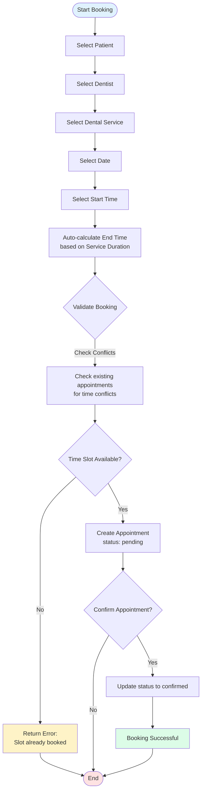
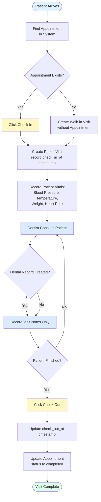
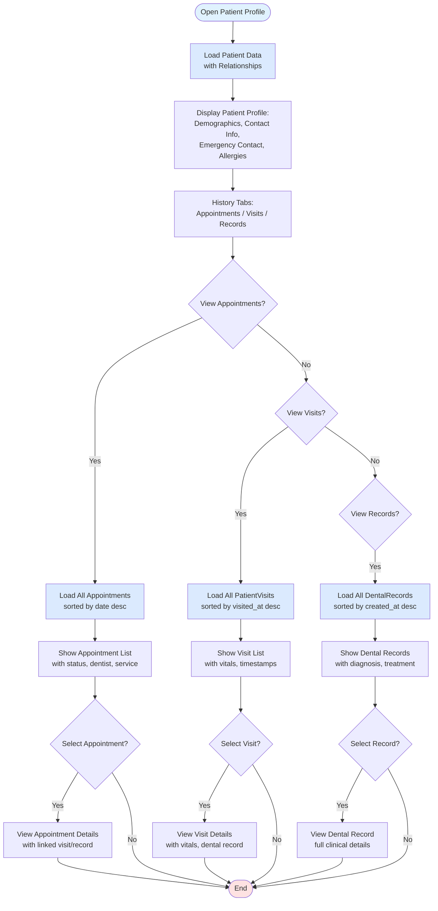
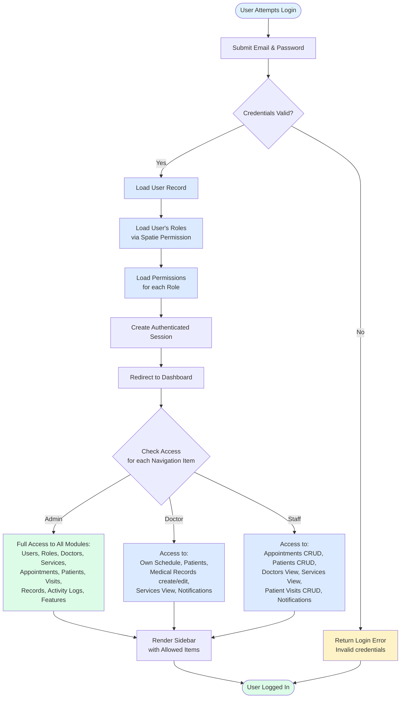
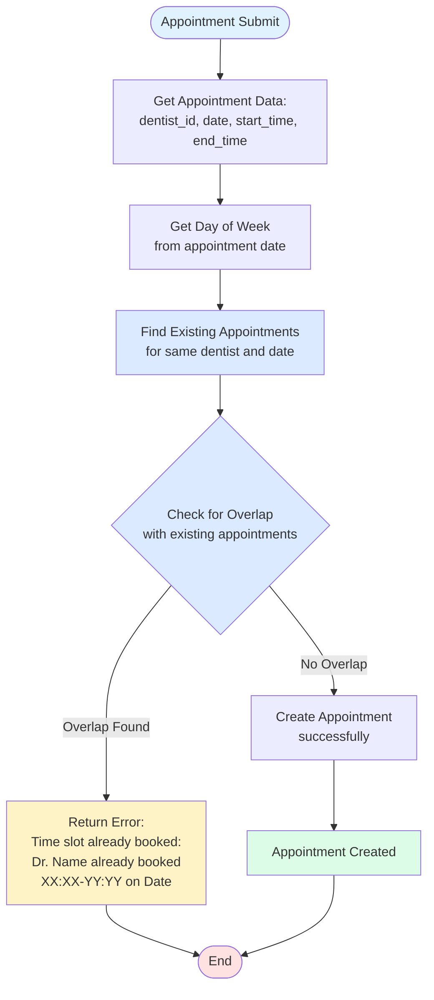
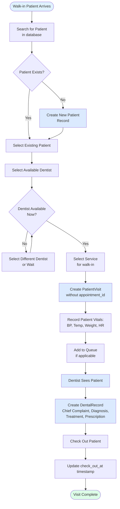
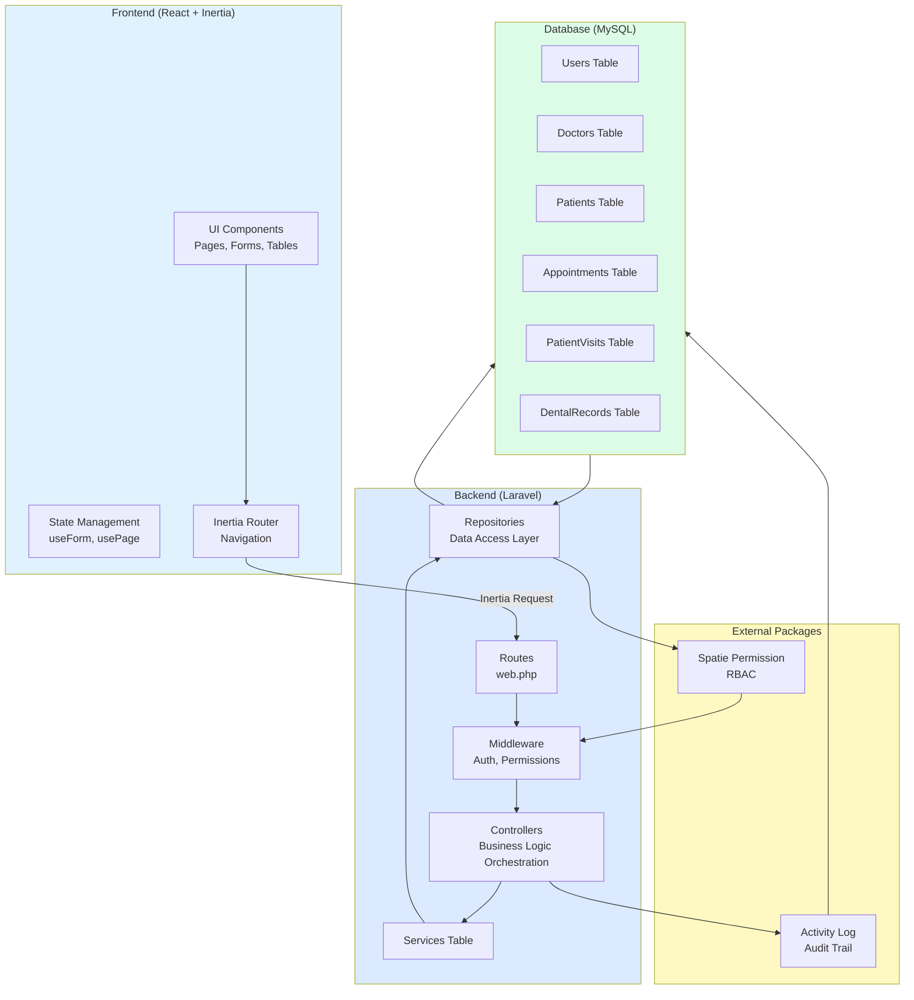

# Dental Clinic Management System — Flow Charts

This document contains detailed flow charts for the Dental Clinic Management System, describing the key processes and workflows based on the dental-scheduling-management-plan.md.

---

## 1. Appointment Booking Flow

### Description
The appointment booking flow is the core process where front desk staff schedule patient appointments with dentists. This flow ensures no double-bookings occur by validating against dentist availability and existing appointments.

### Flow Chart

### Step-by-Step Description

1. **Select Patient**: Front desk staff searches and selects a patient from the patient database. If the patient doesn't exist, they can create a new patient record first.

2. **Select Dentist**: Staff selects the dentist who will perform the service. The system displays only active dentists.

3. **Select Dental Service**: Staff selects the dental service (e.g., Dental Cleaning, Root Canal). Each service has a predefined duration in minutes.

4. **Select Date**: Staff selects the appointment date. The system prevents selecting past dates.

5. **Select Start Time**: Staff selects the start time for the appointment.

6. **Auto-calculate End Time**: The system automatically calculates the end time by adding the service's duration to the start time. Staff can override this if needed.

7. **Validate Booking**: The system performs conflict detection:
   - **Conflict Check**: Queries existing appointments for the same dentist on the same date to ensure no overlap with confirmed or pending appointments.

8. **Create Appointment**: If validations pass, the appointment is created with status `pending`. The system records:
   - Patient ID
   - Dentist ID
   - Service ID
   - Appointment date and time
   - Notes
   - Created by (current user)

9. **Confirm Appointment**: Staff can immediately confirm the appointment, changing status to `confirmed`, or leave it as pending for later confirmation.

10. **Booking Successful**: The appointment is now visible on the Daily Board and Today's Schedule views.

---

## 2. Patient Visit Workflow

### Description
The patient visit workflow tracks the actual physical visit of a patient to the clinic. This workflow bridges the gap between a scheduled appointment and the clinical dental record.

### Flow Chart

### Step-by-Step Description

1. **Patient Arrives**: Patient physically arrives at the clinic for their scheduled appointment or as a walk-in.

2. **Find Appointment**: Front desk staff searches for the patient's appointment in the system using the patient's name or appointment ID.

3. **Check In**: 
   - If appointment exists: Staff clicks "Check In" button on the appointment or patient visit page.
   - If no appointment (walk-in): Staff creates a new PatientVisit record directly, selecting the patient and dentist.

4. **Create PatientVisit**: The system creates a `PatientVisit` record with:
   - Patient ID
   - Dentist ID
   - Appointment ID (if applicable)
   - `check_in_at` timestamp
   - Initial status

5. **Record Vitals**: Staff records the patient's vital signs:
   - Blood pressure
   - Temperature
   - Weight
   - Heart rate
   These are stored in the PatientVisit record.

6. **Dentist Consults Patient**: The dentist sees the patient and performs the dental examination or procedure.

7. **Create Dental Record**: 
   - Dentist creates a `DentalRecord` linked to the PatientVisit
   - Records clinical information: chief complaint, diagnosis, treatment performed, prescription, and notes
   - This is the permanent clinical record of the visit

8. **Check Out**: When the patient leaves, front desk staff clicks "Check Out".

9. **Update Check Out**: System updates the `check_out_at` timestamp on the PatientVisit record.

10. **Complete Appointment**: If the visit was linked to an appointment, the appointment status is automatically updated to `completed`.

11. **Visit Complete**: The patient's visit is now fully tracked in the system with timestamps, vitals, and clinical records.

---

## 3. Patient History Access Flow

### Description
This flow describes how users (doctors, staff, admins) access a patient's complete dental history, replacing the physical envelope system with a digital, queryable history.

### Flow Chart

### Step-by-Step Description

1. **Open Patient Profile**: User navigates to a patient's profile page via search or from an appointment/visit.

2. **Load Patient Data**: System loads the patient record with all related data:
   - Basic demographics (name, DOB, gender)
   - Contact information (phone, email, address)
   - Emergency contact details
   - Medical information (blood type, allergies, dental history)

3. **Display Patient Profile**: System displays the patient's complete profile information in a clean, organized layout.

4. **History Tabs**: Patient profile includes tabs to view different aspects of history:
   - Appointments: All scheduled and past appointments
   - Visits: All physical visits with timestamps and vitals
   - Records: All dental records (clinical documentation)

5. **View Appointments**: When selected, system loads all appointments for the patient, sorted by date descending (most recent first). Each appointment shows:
   - Date and time
   - Dentist
   - Service
   - Status (pending, confirmed, completed, cancelled, no-show)
   - Link to appointment details

6. **View Visits**: When selected, system loads all PatientVisit records, sorted by visit date descending. Each visit shows:
   - Visit date and time
   - Dentist
   - Check-in/check-out timestamps
   - Vitals (BP, temperature, weight, heart rate)
   - Link to visit details

7. **View Records**: When selected, system loads all DentalRecord records, sorted by creation date. Each record shows:
   - Visit date
   - Dentist
   - Chief complaint
   - Diagnosis
   - Treatment performed
   - Prescription
   - Link to full record details

8. **Select Appointment/Visit/Record**: User can click on any item to view full details.

9. **View Details**: System displays the complete details of the selected item, including all related information (e.g., selecting a visit shows the associated dental record).

10. **Digital Envelope**: This complete, chronological view replaces the physical envelope system, allowing instant access to a patient's entire dental history.

---

## 4. User Authentication & Authorization Flow

### Description
This flow describes how users authenticate into the system and how role-based access control (RBAC) determines what features and data they can access.

### Flow Chart

### Step-by-Step Description

1. **Submit Credentials**: User enters their email and password on the login page.

2. **Validate Credentials**: Laravel's authentication system validates the credentials against the `users` table using Laravel Breeze.

3. **Load User**: If credentials are valid, the system loads the user record.

4. **Load Roles**: Using Spatie Laravel Permission, the system loads all roles assigned to the user (Admin, Doctor, Staff).

5. **Load Permissions**: For each role, the system loads all associated permissions (e.g., `appointments.view`, `patients.create`, `medical_records.edit`).

6. **Create Session**: An authenticated session is created, storing the user's ID, roles, and permissions.

7. **Redirect to Dashboard**: User is redirected to the dashboard page.

8. **Check Access**: The sidebar navigation uses the `usePermission` hook to check if the user has the required permissions for each navigation item:
   - Navigation items have `permissions` array specifying required permissions
   - Items with `roles` array are only shown to users with those roles
   - Items without restrictions are shown to all authenticated users

9. **Role-Based Access**:
   - **Admin**: Full access to all modules including system administration (Users, Roles, Features, Activity Logs)
   - **Doctor**: Access to own schedule, patients, medical records (view/create/edit), services view, notifications. Cannot access system administration.
   - **Staff**: Access to appointments (full CRUD), patients (view/create/edit), doctors view, services view, patient visits (full CRUD), notifications. Cannot access medical records or system administration.

10. **Render Sidebar**: The sidebar is rendered with only the navigation items the user is authorized to access.

11. **User Logged In**: User can now navigate the system and perform actions based on their permissions. All controller actions are protected by permission middleware to ensure backend security.

---

## 5. Appointment Conflict Detection Flow

### Description
This flow describes the validation logic that prevents double-booking and ensures appointments are scheduled within dentist availability windows.

### Flow Chart

### Step-by-Step Description

1. **Get Appointment Data**: System extracts the appointment data from the form submission:
   - `dentist_id`: The selected dentist
   - `appointment_date`: The selected date
   - `start_time`: The selected start time
   - `end_time`: The calculated end time

2. **Find Existing Appointments**: System queries the `appointments` table for:
   - Same `dentist_id`
   - Same `appointment_date`
   - Status in: `pending`, `confirmed`, `in_progress`
   - Excludes: `cancelled`, `completed`, `no_show`

8. **Check for Overlap**: For each existing appointment, system checks if time ranges overlap:
   - Overlap condition: `(new_start < existing_end) AND (new_end > existing_start)`
   - This catches all overlap scenarios (partial, complete, nested)

9. **Conflict Error**: If overlap is found, system returns a descriptive error:
   - "Dr. [Name] is already booked [Time Range] on [Date]"
   - This helps staff quickly identify the conflicting appointment

10. **Create Appointment**: If all validations pass, the appointment is created successfully.

11. **Success**: Appointment is saved and visible in the system.

---

## 6. Walk-in Visit Flow

### Description
This flow describes how front desk staff handle patients who arrive without a scheduled appointment. This is a common scenario in dental clinics.

### Flow Chart

### Step-by-Step Description

1. **Walk-in Patient Arrives**: Patient arrives at the clinic without a scheduled appointment.

2. **Search for Patient**: Front desk staff searches the patient database by name or phone number.

3. **Patient Exists Check**: 
   - If patient exists: Staff selects the existing patient record
   - If patient doesn't exist: Staff creates a new patient record with:
     - First name, last name
     - Contact information (phone, email)
     - Basic demographics (DOB, gender)
     - Emergency contact

4. **Select Dentist**: Staff selects which dentist will see the patient. The system may show which dentists are currently available based on:
   - Current queue/load for each dentist

5. **Dentist Available Check**: System verifies the selected dentist is available at the current time.

6. **Select Service**: Staff selects the dental service the patient is being seen for (e.g., Emergency, Consultation, Tooth Pain).

7. **Create PatientVisit**: System creates a `PatientVisit` record with:
   - Patient ID
   - Dentist ID
   - `appointment_id`: NULL (this is a walk-in)
   - `visited_at`: current timestamp
   - `check_in_at`: current timestamp
   - Notes indicating this is a walk-in

8. **Record Vitals**: Staff records the patient's vital signs (BP, temperature, weight, heart rate) in the PatientVisit record.

9. **Add to Queue**: If the clinic uses a queue system, the patient is added to the queue with a position number.

10. **Dentist Sees Patient**: The dentist consults the patient, performs examination or procedure.

11. **Create Dental Record**: Dentist creates a `DentalRecord` linked to the PatientVisit with:
    - Chief complaint
    - Diagnosis
    - Treatment performed
    - Prescription
    - Notes

12. **Check Out**: Front desk staff clicks "Check Out" when the patient leaves.

13. **Update Check Out**: System updates the `check_out_at` timestamp on the PatientVisit.

14. **Visit Complete**: The walk-in visit is now fully documented in the system, with the same traceability as scheduled appointments.

---

## 7. System Architecture Overview

### Description
High-level architecture showing the relationship between frontend, backend, database, and key services.

### Flow Chart

### Component Description

**Frontend Layer:**
- **UI Components**: React components built with shadcn/ui and Tailwind CSS for forms, tables, cards, modals
- **State Management**: Inertia's `useForm` for form handling, `usePage` for accessing page props
- **Router**: Inertia.js router for client-side navigation without page reloads

**Backend Layer:**
- **Routes**: Defined in `routes/web.php`, maps URLs to controllers
- **Middleware**: 
  - Authentication middleware (Laravel Breeze)
  - Permission middleware (Spatie) for role-based access
  - Inertia middleware for sharing data with frontend
- **Controllers**: Handle HTTP requests, orchestrate business logic, return Inertia responses
- **Services**: Contain business logic (e.g., `AppointmentService` for conflict detection)
- **Repositories**: Abstract data access, implement repository pattern for testability

**Database Layer:**
- **Users**: User accounts with authentication
- **Doctors**: Dentist profiles linked to users
- **Patients**: Patient records with medical history
- **Services**: Dental services with pricing and duration
- **Appointments**: Scheduled appointments with status workflow
- **PatientVisits**: Physical visit records with vitals and timestamps
- **DentalRecords**: Clinical records linked to visits

**External Packages:**
- **Spatie Permission**: Role-based access control (RBAC) system
- **Activity Log**: Audit trail for tracking all system changes

---

## Summary

This flow chart document covers the seven key processes in the Dental Clinic Management System:

1. **Appointment Booking Flow** - From patient selection to confirmation
2. **Patient Visit Workflow** - From check-in to check-out with clinical records
3. **Patient History Access Flow** - Digital replacement for physical envelopes
4. **User Authentication & Authorization Flow** - RBAC implementation
5. **Appointment Conflict Detection Flow** - Prevention of double-booking
6. **Walk-in Visit Flow** - Handling unscheduled patients
7. **System Architecture Overview** - High-level component relationships

These flows ensure the system achieves the business goals of eliminating paper-based scheduling, providing complete patient history, preventing conflicts, and enabling efficient clinic operations.
